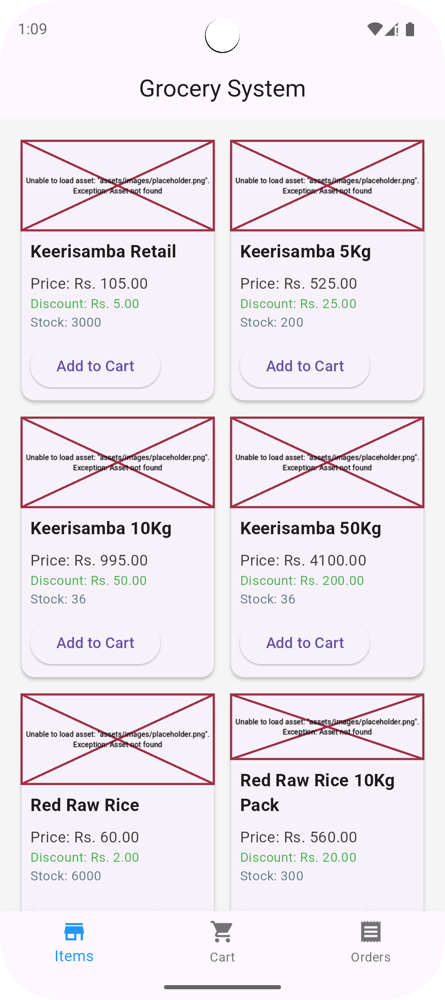
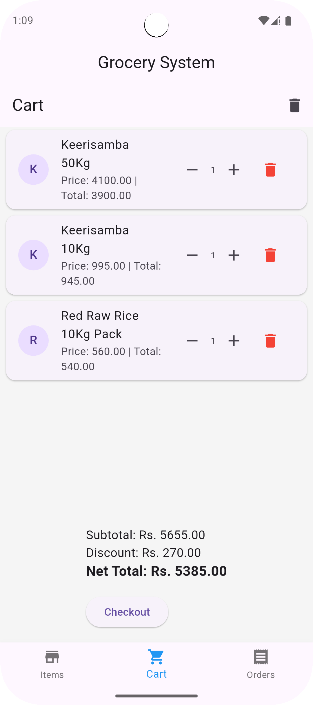
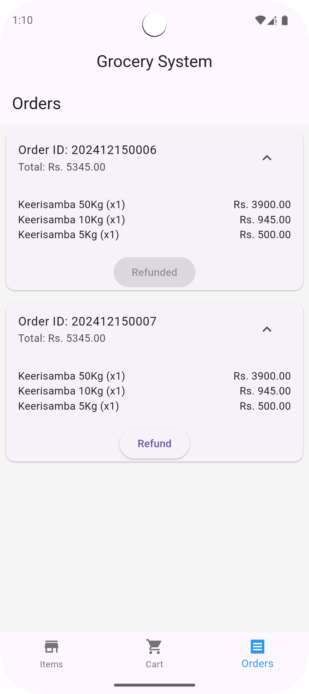

# Grocery Management System

A functional **Grocery Management System** built with **Flutter** and **Dart**, featuring item management, a cart system, discount calculations, order tracking, and refund functionality.

---

## Features

### 1. **Item Management**
- View all available grocery items with:
    - **Name**
    - **Price**
    - **Stock**
    - **Discount**
- Add items to the cart, with discounts automatically applied to the prices.

### 2. **Cart Management**
- Manage items in your cart:
    - **Increase or Decrease Quantities**
    - **Remove Items**
    - **Clear Cart**
- Displays a detailed price breakdown:
    - **Subtotal**
    - **Total Discount**
    - **Net Total**
- **Checkout Functionality**:
    - Validates stock availability.
    - Deducts stock upon successful checkout.
    - Saves the order to the order history.

### 3. **Order Management**
- View completed orders, including:
    - Unique **Order ID** formatted as `yyyyMMddHHmm`.
    - **Subtotal**, **Total Discount**, and **Net Total**.
    - **Order Date and Time**.
- Expandable order details showing all items in the order.
- **Refund Functionality**:
    - Mark orders as refunded.
    - Display the refund status in the order details.

---

## Installation

1. Clone this repository:
   ```bash
   git clone https://github.com/your-username/grocery-management-system.git
   ```
2. Navigate to the project directory:
   ```bash
   cd grocery-management-system
   ```
3. Install dependencies:
   ```bash
   flutter pub get
   ```
4. Run the project:
   ```bash
   flutter run
   ```

---

## Screenshots

### Item Screen:

- Displays all items with their prices, stock, and discounts.

### Cart Screen:

- Allows users to manage their cart and view a detailed price breakdown.

### Order Screen:
****
- Tracks order history and provides expandable views of item details.

---

## Contribution

Contributions are welcome! Feel free to:
- Fork this repository.
- Submit pull requests with new features or bug fixes.
- Open issues for suggestions or bug reports.

---
